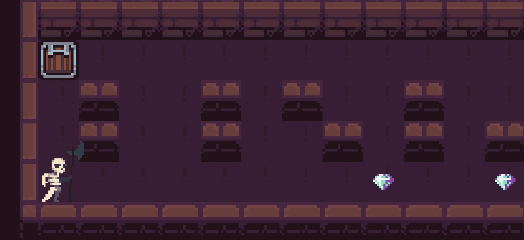

# so_long

## Overview
**so_long** is a simple 2D game developed in C using the **MiniLibX (MLX42)** library. The main objective of this game is to collect all collectibles and reach the exit while navigating through a grid-based map. This project aims to enhance skills in window management, event handling, texture rendering, and basic game logic.

## Game Preview



## Table of Contents
- [Features](#features)
- [Gameplay](#gameplay)
- [Map Structure](#map-structure)
- [Installation](#installation)
- [How to Build](#how-to-build)
- [Usage](#usage)
- [Acknowledgements](#acknowledgements)

## Features
- 2D top-down view with grid-based movement.
- Move the player using **WASD** or **arrow** keys.
- Counts and displays the number of movements in the terminal.
- Exits the game upon pressing **ESC** or clicking the window's close button.

## Gameplay
- The player must collect all the collectibles ('C') on the map.
- After collecting all items, the player can exit the level by reaching the exit ('E').
- The player can move up, down, left, or right but cannot pass through walls ('1').

## Map Structure
- The game uses a map file with a `.ber` extension.
- The map must consist of 5 characters:
  - **'0'**: Empty space
  - **'1'**: Wall
  - **'C'**: Collectible
  - **'E'**: Exit
  - **'P'**: Player starting position
- Requirements for a valid map:
  - Must be rectangular.
  - Must be closed/surrounded by walls.
  - Must have one exit ('E'), at least one collectible ('C'), and one player start position ('P').
  - Must have a valid path from the player to all collectibles and the exit.

### Example of a Valid Map
```
1111111
1P000C1
1000001
1C00E01
1111111
```

## Installation
### Prerequisites
- Ensure you have the following installed:
  - **C compiler** (e.g., `cc`)
  - **Homebrew** (for macOS users)
  - **GLFW** (via Homebrew)
  - **CMake** (via Homebrew)

## How to Build
1. **Clone the so_long repository**:
   ```bash
   git clone <your-repo-url>
   cd so_long
   ```
2. **Compile the project**:
   ```bash
   make
   ```
   - This will create the executable named `so_long`.

## Usage
1. Run the game with a valid map file:
   ```bash
   ./so_long path/to/map_file.ber
   ```
2. Control the player using the **WASD** keys (or **ZQSD** for AZERTY keyboards).
3. The game will display the movement count in the terminal after each move.

## Acknowledgements
- This project uses the **MiniLibX (MLX42)** library for graphics management.
- Map textures and sprites can be found on [itch.io](https://itch.io/game-assets/free/tag-sprites).
